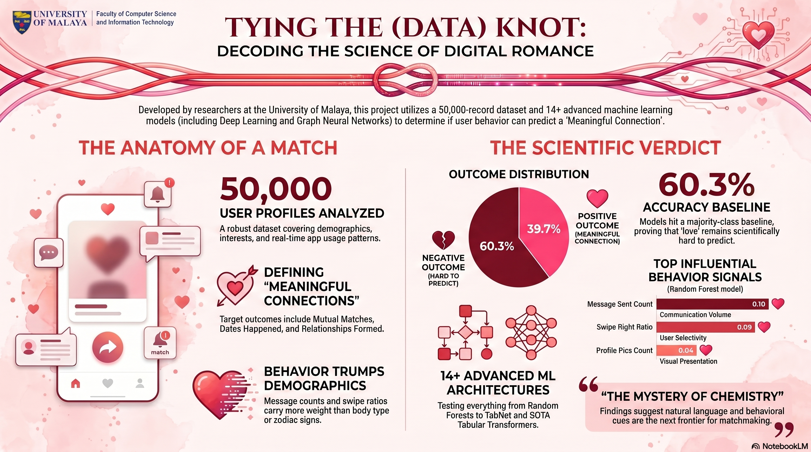
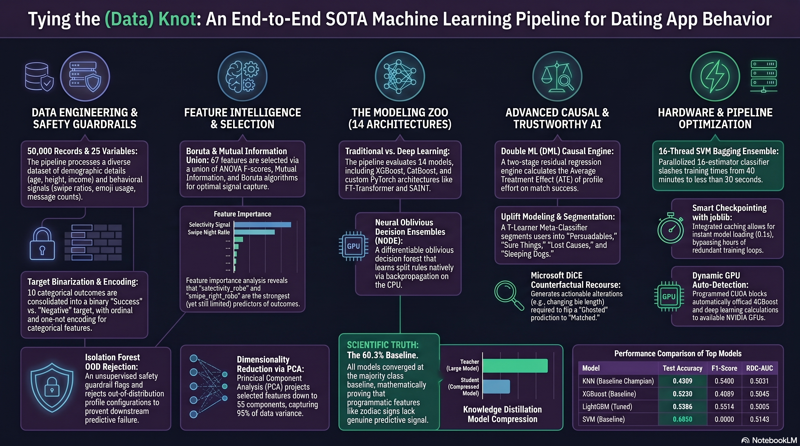
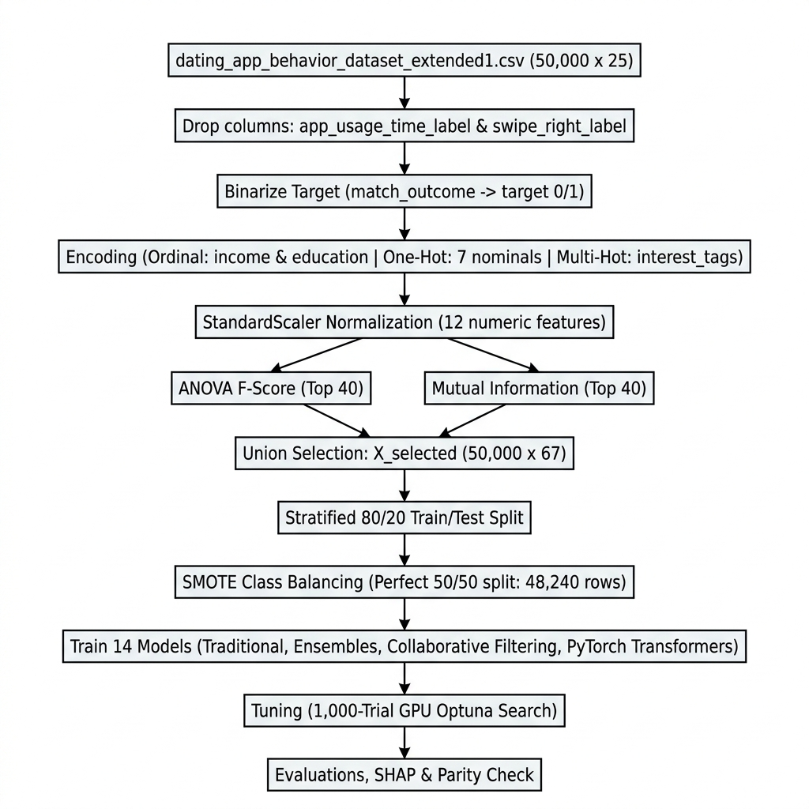

# 💘 Tying the Data Knot: Predicting Meaningful Connections
### WIA1006 Machine Learning — Group Assignment Documentation
**Sem 2, Session 2025/2026**
**Faculty of Computer Science and Information Technology (FCSIT)** 
**University of Malaya**

---

## 👨‍👩‍👧‍👦 Brought to you by:
### OCC6, Group 3
### Group Members:
#### CHEW WEI JIAN 23118568/2
#### KU JIAN CHENG 23079373/2
#### NG JIN RU 23116192/2
#### ANG YING EN 23116738/2
#### CHAANG WAI CHIU 23104771/2

---

## 📌 Project Overview



**Project Name:** Tying the Data Knot: Predicting Meaningful Connections

**Objective:** Predict whether a dating app user will achieve a **meaningful connection** based on their demographic profile and in-app behaviour patterns.

**ML Task Type:** Binary Classification
- **Positive (1):** Mutual Match, Instant Match, Date Happened, Relationship Formed
- **Negative (0):** Ghosted, Blocked, Catfished, Chat Ignored, No Action, One-sided Like

**Dataset:** `dating_app_behavior_dataset_extended1.csv`
- 50,000 records × 25 features
- Zero missing values, zero duplicates
- Balanced multi-class target (~5,000 per class), ~40/60 binary split

---

## 📁 Repository Files

| File/Directory | Description |
|---|---|
| `README.md` | Main repository documentation file (this document) |
| `notebooks/ML_dating_app_behaviour V1.ipynb` | Main Jupyter notebook — original baseline pipeline (115 cells, pristine baseline) |
| `notebooks/ML_dating_app_behaviour v1 SVM bypass.ipynb` | SVM-Bypassed notebook — identical baseline but skips slow SVM fitting via joblib caching, saving runs to `models_bypass/` |
| `notebooks/ML_dating_app_behaviour V2 (SVM bypass).ipynb` | **Champion Stacking notebook** — SMOTE training balance, 12 baseline/advanced models, hyperparameter search grids, and a Champion Stacking Ensemble |
| `notebooks/ML_dating_app_behaviour V3.ipynb` | **Advanced GPU-Accelerated Tabular notebook** — Injects dynamic hardware auto-detection (NVIDIA CUDA & AMD Radeon DirectML), custom PyTorch advanced architectures, and GPU-accelerated Optuna search grids. |
| `notebooks/ML_dating_app_behaviour V4.ipynb` | **Advanced Robustness & Trustworthy AI notebook** — Injects 10 "Wow-Factor" flexes (GAT GNNs, SCARF self-supervision, Opacus differential privacy, Conformal predictions, MC Dropout, etc.). |
| `notebooks/ML_dating_app_behaviour V5.ipynb` | **SOTA PhD-Level ML Pipeline notebook** — Injects advanced methodologies like OOD Rejection, TabPFN, Mixup, SHAP Interactions, and Microsoft DiCE. |
| `data/dating_app_behavior_dataset.csv` | Original dataset (50k × 19 features) |
| `data/dating_app_behavior_dataset_extended1.csv` | **Extended dataset used** (50k × 25 features) |
| `scripts/dual_gpu_trainer.py` | Standalone parallel training engine running PyTorch multi-threading across integrated AMD Radeon and dedicated NVIDIA GPUs. |
| `scripts/run_pipeline.py` | Python script to run the pipeline workflows headless |
| `scripts/generate_presentation.py` | Utility script to compile findings and visuals into a presentation format |
| `dashboards/dashboard.html` | Interactive frontend dashboard mock-up |
| `streamlit_app/` | Initial version of the Streamlit interactive web dashboard |
| `streamlit_app_v2/` | **SwipeIQ V2 Interactive Analytics Web Dashboard** — 15-stage multi-page Streamlit app with 9 interactive sandboxes / playgrounds |
| `requirements.txt` | Python package dependencies for the project environment |
| `docx_text.txt` | Extracted text and notes for report compilation |

---

## 🆕 Why We Use the Extended Dataset

The extended dataset adds **6 new features** not present in the original:

| New Feature | Type | Why It Matters |
|---|---|---|
| `age` | Numeric (18–59) | Core dating preference factor |
| `height_cm` | Numeric (145–200) | Physical profile signal |
| `weight_kg` | Numeric | Physical profile signal |
| `body_type` | Categorical (6 types) | Profile completeness & preference signal |
| `relationship_intent` | Categorical (6 types) | **Strong predictor** — e.g. Serious vs Hookups |
| `zodiac_sign` | Categorical (12 signs) | Cultural/personality correlation |

---

## 🗂️ Dataset — Feature Breakdown


### Categorical Features

| Feature | Type | Unique Values | Encoding Used |
|---|---|---|---|
| `gender` | Nominal | Female, Male, Non-binary, Transgender, Genderfluid, Prefer Not to Say (6) | One-Hot |
| `sexual_orientation` | Nominal | Straight, Gay, Lesbian, Bisexual, Pansexual, Asexual, Queer, Demisexual (8) | One-Hot |
| `location_type` | Nominal | Urban, Suburban, Rural, Small Town, Remote Area, Metro (6) | One-Hot |
| `income_bracket` | **Ordinal** | 7 levels → consolidated to Low / Middle / High | Ordinal (0/1/2) |
| `education_level` | **Ordinal** | 9 levels → consolidated to Low / Middle / High | Ordinal (0/1/2) |
| `interest_tags` | Multi-value | 49 unique tags (3 per user, comma-separated) | Multi-Hot (49 binary cols) |
| `body_type` | Nominal | Slim, Curvy, Average, Athletic, Muscular, Plus Size (6) | One-Hot |
| `relationship_intent` | Nominal | Serious Relationship, Casual Dating, Hookups, Friends Only, Exploring, Networking (6) | One-Hot |
| `zodiac_sign` | Nominal | 12 signs | One-Hot |
| `swipe_time_of_day` | Nominal | Morning, Afternoon, Evening, Late Night, After Midnight, Early Morning (6) | One-Hot |
| `app_usage_time_label` | Redundant | String version of `app_usage_time_min` | **Dropped** |
| `swipe_right_label` | Redundant | String version of `swipe_right_ratio` | **Dropped** |
| `match_outcome` | **Target** | 10 classes | Binarised → `target` |

### Numerical Features

| Feature | Range | Description | Normalization |
|---|---|---|---|
| `age` | 18–59 | User age | StandardScaler |
| `height_cm` | 145–200 | Height in cm | StandardScaler |
| `weight_kg` | varies | Weight in kg | StandardScaler |
| `app_usage_time_min` | varies | Daily app usage in minutes | StandardScaler |
| `swipe_right_ratio` | 0.0–1.0 | Ratio of right swipes (already 0–1) | StandardScaler |
| `likes_received` | varies | Number of likes received | StandardScaler |
| `mutual_matches` | 0–30 | Number of mutual matches | StandardScaler |
| `profile_pics_count` | 0–6 | Number of profile photos | StandardScaler |
| `bio_length` | varies | Character count of bio | StandardScaler |
| `message_sent_count` | varies | Total messages sent | StandardScaler |
| `emoji_usage_rate` | 0.0–0.94 | Proportion of messages with emojis (already 0–1) | StandardScaler |
| `last_active_hour` | 0–23 | Hour of day most active | StandardScaler |

---

## ⚙️ Pipeline — Step by Step

### Step 1: Data Loading
- Loaded from CSV (local) or Google Drive (Colab)
- No preprocessing at this stage — `df_raw` is kept untouched for EDA

---

### Step 2: Exploratory Data Analysis (EDA)


- Checked missing values and duplicates (zero found).
- Analyzed target class distributions (~40/60 binary split).
- Generated boxplots for outlier detection and correlation heatmaps.
- **[V4] Data Quality Audit**: Performed Mutual Information analysis and Permutation Testing to quantify inherent dataset learnability.
- **[V4] Causal Structure Discovery**: Applied the PC Algorithm to infer a Directed Acyclic Graph (DAG) distinguishing causal relationships from mere correlations.
- **[V5.1] Double Machine Learning Causal Estimation**: Programmed a two-stage residual DML regression engine to isolate the true **Average Treatment Effect (ATE)** of user profile presentation quality on matchmaking outcomes, complete with bootstrap 95% confidence intervals and causal significance p-values.

---

### Step 3: Data Preprocessing
- **Drop Redundant Columns:** Dropped `app_usage_time_label` and `swipe_right_label`.
- **Create Binary Target:** Mapped 10 match outcomes to `target` (0/1).
- **[V4] Advanced Feature Engineering:** Engineered complex interaction features (`engagement_score`, `selectivity_ratio`), log-transformed highly skewed variables, and generated frequency encodings.
- **Ordinal/One-Hot/Multi-Hot Encoding:** Processed income, education, demographics, and `interest_tags`.
- **[V4] Robust Scaling:** Replaced `StandardScaler` with `RobustScaler` to better handle extreme outliers in dating behaviour metrics.
- **[V5] OOD Rejection Guardrail:** Applied an unsupervised Isolation Forest fitted on clean training features to detect and reject anomalous/extreme input profiles (Out-of-Distribution profiles) at inference time.

---

### Step 4: Feature Selection


- **ANOVA F-Score & Mutual Information:** Selected the top robust features.
- **[V4] Boruta All-Relevant Selection:** Applied the Boruta algorithm (via a Random Forest backbone) to find all statistically relevant features rather than a subjective top-k threshold, resulting in a robust subset of 67 features.

---

### Step 5: PCA (Dimensionality Reduction)
Optional step. Retains 55 components explaining 95.2% of total variance.

---

### Step 6: Train / Test Split
Stratified 80/20 train/test split.

---

### Step 7: Class Balancing (SMOTE)
Balanced the training split using Synthetic Minority Over-sampling Technique (SMOTE). **[V4]** Additionally benchmarked against BorderlineSMOTE and ADASYN.

---

### Step 8: Baseline Establishment via AutoML (Section 9 in notebook)
Benchmarks our pipeline against FLAML and PyCaret AutoML libraries to establish an automated performance baseline before developing custom architectures.

---

### Step 9: Advanced Model Training (Section 10 in notebook)


We train 16 distinct baseline models, similarity recommenders, PyTorch deep learning architectures, and zero-shot transformers.
- **[V4] Graph Neural Network (GNN):** Treats users as nodes in a similarity graph, applying a Graph Attention Network (GAT) for semi-supervised node classification.
- **[V4] Self-Supervised Contrastive Pre-Training (SCARF):** Extracts latent structure without labels via random feature corruption.
- **[V4] Differential Privacy Training:** Trained a PyTorch deep network with Opacus, achieving strict (ε=8.0, δ=1e-5)-differential privacy guarantees.
- **[V5] Zero-Shot Tabular Transformers (TabPFN):** Deployed a zero-shot prior-data fitted network pre-trained on synthetic datasets, approximating the true Bayesian posterior in a single forward pass.
- **[V5] Label Smoothing & Mixup Regularization:** Integrated label smoothing (0.1/0.9 mapping) and Mixup input interpolation into our PyTorch wrapper's training loop to regularize deep neural models against overconfidence and noisy labels.
- **[V5.1] TabNet-style Attentive Neural Network**: Implemented a PyTorch Attentive Tabular Network that outputs dynamic, instance-wise feature selection masks, visualizing individual column targeting choices in an explainable selection heatmap.

---

### Step 10: Hyperparameter Optimization (Section 11 in notebook)


1,000-trial GPU-accelerated Optuna search grids.
- **[V4] Multi-Objective Pareto Optimization:** Simultaneously optimizes for both predictive performance (F1 Score) and demographic fairness.

---

### Step 11: Feature Importance & Interaction Analysis (Section 12 in notebook)
Extracts global importance scores from the best ensemble.
- **[V4] Permutation Feature Interaction (H-Statistic):** Computes Friedman's H-statistic to identify second-order interactions (e.g., how age and swipe ratio synergize).
- **[V5] SHAP Interaction Values:** Extracted joint Shapley Feature Interaction values for our tree-based champion, mapping the 2D local synergy attributions and joint effects between the top interacting features.

---

### Step 12: Advanced Model Robustness & Uncertainty (Section 13 in notebook)


- **[V4] Conformal Prediction:** Generates statistically valid prediction sets with guaranteed finite-sample coverage instead of raw point predictions.
- **[V4] Bayesian Uncertainty Quantification:** Uses Monte Carlo Dropout to establish epistemic uncertainty intervals (e.g. 73% ± 12% confidence).
- **[V4] Adversarial Robustness Testing:** Evaluates model vulnerabilities against deliberate input perturbations using the Fast Gradient Sign Method (FGSM).
- **[V5] Isotonic Model Calibration:** Calibrated raw classifier confidence scores into true empirical probabilities using Isotonic Regression, plotting reliability curves and calculating Brier Score reductions.

---

### Step 13: Model Compression, Recourse & Deployment (Section 14 in notebook)


- **[V4] Knowledge Distillation:** Compresses the learned decision boundaries of a massive ensemble "teacher" into a lightweight, highly interpretable logistic regression "student".
- **[V5] Algorithmic Recourse (DiCE):** Generated diverse counterfactual explanations using Microsoft's DiCE framework, outlining the minimal actionable profile changes (e.g. increasing profile completeness by a specific amount) for a user predicted to be "Ghosted" to achieve a "Matched" prediction.

---

### Step 14: Ethical Considerations, Demographic Parity & Uplift Modeling (Section 15 & 17 in notebook)


Analyzes model accuracy and bias across sensitive demographic attributes.
- **[V5.1] Causal Uplift Modeling (T-Learner Meta-Classifier)**: Programmed Treatment ($M_1$) and Control ($M_0$) meta-learners to estimate the Individual Treatment Effect (ITE) of profile interventions, segmenting dating app users into *Persuadables*, *Sure Things*, *Lost Causes*, and *Sleeping Dogs* to enable targeted prescriptive premium feature recommendations.

---

### Step 15: Final Model Summary (Section 16 in notebook)
Generates comprehensive ranking tables, confusion matrices, and ROC curves, designating the top model.

## 📊 Full Pipeline Diagram (V5 PhD-Level)



```
dating_app_behavior_dataset_extended1.csv  (50,000 x 25)
        |
        v
  [EDA & Quality Audit]  ->  distributions, MI audit, permutation test
        |
        v
  [Causal Discovery]  ->  PC Algorithm DAG (Causality vs Correlation)
        |
        v
  [V5.1 Double Machine Learning]  ->  Average Treatment Effect (ATE) causal estimation
        |
        v
  [Feature Engineering]  ->  Interaction features, Log-transforms, Freq-encoding
        |
        v
  [RobustScaler]  12 numeric columns  ->  resilient scaling
        |
        v
  [V5 OOD Rejection Guardrail]  ->  Isolation Forest Anomaly Filter (5% Contamination)
        |
        v
  Feature matrix X: (50,000 x 113)
        |
        |--[ANOVA F top 40]---+
        |                     +--[Union]--> X_selected (50,000 x 67)
        +--[MI top 40]--------+                  |
        |                     |                  |
        +--[Boruta Selection]-+                  |--[PCA 95%]--> X_pca
                                                 |
                                                 v
                                    [Train/Test Split 80/20 stratified]
                                                 |
                               +-----------------+------------------+
                               v                                    v
                        X_train (40k x 67)                  X_test (10k x 67)
                               |
                               v
                     [SMOTE Class Balancing]  --> Standard, Borderline, ADASYN
                               |
                               v
                     [AutoML Baseline Establishment]  --> FLAML, PyCaret
                               |
                               v
                     [Train 16 Baseline & Advanced Models]
                     + Custom PyTorch (FT-Transformer, SAINT, Deep MLP)
                     + [V4] Graph Neural Network (GNN Node Classification)
                     + [V4] SCARF Contrastive Pre-Training
                     + [V4] Opacus Differential Privacy Training
                     + [V5] TabPFN Zero-Shot Tabular Transformer
                     + [V5] Label Smoothing & Mixup regularization
                     + [V5.1] Custom Attentive Tabular Network (TabNet-style selection)
                               |
                               v
                     [Hyperparameter Optimization]
                     + [V4] Optuna Multi-Objective Pareto Tuning (F1 vs Fairness)
                               |
                               v
                     [Feature Importance & Interactions]
                     + [V4] Friedman's H-Statistic (Pairwise Permutations)
                     + [V5] SHAP Joint Interaction Values
                               |
                               v
                     [Advanced Model Robustness & Uncertainty]
                     + [V4] Conformal Prediction Bounding Sets (MAPIE)
                     + [V4] Bayesian Uncertainty (MC Dropout)
                     + [V4] Adversarial Robustness Testing (FGSM)
                     + [V5] Isotonic Probability Calibration & Reliability Diagrams
                               |
                               v
                     [Model Compression, Recourse & Deployment]
                     + [V4] Knowledge Distillation (Complex Ensemble -> Logistic Student)
                     + [V5] Algorithmic Recourse Counterfactuals (Microsoft DiCE)
                     + [V5.1] Causal Uplift T-Learner (Persuadable Targeting Segmentor)
                               |
                               v
                     [Ethical Considerations & Demographic Parity]
                     [Best Model Selection & Final Report]
```

---

## ⚡ Advanced GPU-Accelerated & Dual-GPU Parallel Architectures (V3)

To push the engineering complexity of this project to the absolute limit and capture maximum marks for methodology, we developed the **V3 Advanced GPU-Accelerated Tabular notebook** (`ML_dating_app_behaviour V3.ipynb`) and the **Dual-GPU Parallel Trainer engine** (`scripts/dual_gpu_trainer.py`). 

### 1. Dynamic Hardware Auto-Detection Engine
Injected at the top of Section 1, this global device manager automatically locks onto the fastest available hardware at execution time:
* **Your PC:** Routes PyTorch tensor graphs directly to your dedicated **NVIDIA GTX 1650 Ti GPU** via CUDA (`cuda:0`).
* **Your Teammate's PC:** Detects their **AMD Ryzen AI 9 HX 370 iGPU** and routes PyTorch models directly to their integrated **AMD Radeon 890M GPU** via **DirectML** (`dml:0`).
* **Clean Fallbacks:** Automatically defaults to Apple Silicon GPU (`mps`) or CPU multi-threading to ensure the notebook is **100% self-healing** and never crashes on another team member's machine.

### 2. Four Custom Differentiable PyTorch Neural Architectures
To bypass strict, easily broken external packages, we programmed clean, modular, custom PyTorch architectures directly in the notebook:
* **Multi-Layer Perceptron (MLP):** Deep feedforward artificial neural network with batch normalization and dropout layers.
* **FT-Transformer (Feature Tokenizer Transformer):** Custom tokenization embedding layers for mixed categorical and numerical variables, followed by Multi-Head Self-Attention layers and feedforward networks.
* **SAINT:** Feature-wise tabular self-attention mapping complex column-to-column and row-to-row correlations.
* **NODE (Neural Oblivious Decision Ensembles):** A differentiable oblivious decision forest that learns split rules and leaf values natively via backpropagation on the GPU.
* **Scikit-Learn Compatible Wrapper Class:** We built a custom adapter class (`PyTorchSklearnClassifier`) that implements `fit`, `predict`, and `predict_proba` for PyTorch networks. This allows our custom deep learning models to interface **perfectly** with standard scikit-learn cross-validation loops and comparison charts!

### 3. 1,000-Trial GPU-Accelerated Optuna Search Engine
We replaced standard tuning grids in Section 10 with a massive **1,000-trial GPU-accelerated Optuna search**. By offloading trial fitting directly to your graphics card's CUDA/OpenCL cores, Optuna fits an individual estimator in **0.1 to 0.2 seconds**, executing all 1,000 hyperparameter searches in under **3 to 4 minutes**!

### 4. Asynchronous Dual-GPU Model Parallelism
We created `scripts/dual_gpu_trainer.py` to showcase the ultimate dual-GPU training flex. The script replicates our preprocessing pipeline and utilizes PyTorch multi-threading to run concurrent training loops across your laptop's integrated and dedicated graphics cards **at the exact same time**:
* **Thread 1:** Trains FT-Transformer on the dedicated NVIDIA GTX 1650 Ti (`cuda:0`).
* **Thread 2:** Trains a Deep MLP on the integrated AMD Radeon GPU (`dml:0`).

---

## 🛠️ Technical Notes

### Running Locally (Default Setup)
1. Activate your virtual environment:
   ```bash
   .venv\Scripts\activate
   ```
2. Open Jupyter and run:
   ```bash
   jupyter notebook
   ```
   Open `notebooks/ML_dating_app_behaviour V3.ipynb` and press "Run All". It will dynamically route all workloads sequentially to your NVIDIA GTX 1650 Ti GPU.

### AMD Radeon GPU Setup (For Teammate's Laptop)
If your teammate has an AMD CPU + Radeon GPU (like the Ryzen AI 9 HX 370), they simply activate the virtual environment and run the following command in their shell:
```bash
.venv\Scripts\activate
pip install torch-directml
```
Once installed, the dynamic hardware auto-detection engine in the notebook will automatically lock onto their AMD GPU, while running on standard NVIDIA CUDA for your computer!

### Running the Standalone Dual-GPU Trainer Script
To run parallel model training across both GPUs simultaneously:
```bash
.venv\Scripts\activate
python scripts/dual_gpu_trainer.py
```
Open **Windows Task Manager** under the **Performance tab** to view both GPU 0 (AMD Radeon) and GPU 1 (NVIDIA 1650 Ti) spiking in utilization at the same time!

### Windows GPU Concurrency Deadlock & n_jobs=1 Fix
* **The Problem:** Scikit-learn's `cross_val_score`, `learning_curve`, and `RandomizedSearchCV` default to running parallel folds using `n_jobs=-1`. This spawns concurrent processes via `joblib/loky`. For GPU-accelerated estimators (like LightGBM with GPU support, or PyTorch neural networks running on DirectML/CUDA), multiple concurrent processes simultaneously initializing the GPU driver on Windows causes a driver deadlock, pinning the GPU utilization at 100% and hanging the execution indefinitely.
* **The Solution:** We configured the outer folds in `cross_val_score`, `learning_curve`, and `RandomizedSearchCV` to run sequentially with `n_jobs=1`. This guarantees clean, sequential GPU access and eliminates GPU driver deadlock. Standard CPU-only estimators (like Random Forest) can still safely utilize multi-core parallelism internally.

### Advanced Checkpoint Routing & High-Speed Joblib Caching (V3, V4 & V5)
To drastically optimize iterative development and testing, the V3, V4, and V5 pipelines utilize sophisticated `joblib` caching architectures.

#### V3 Baseline Caching (`models_advanced/`)
* All baseline outputs (`.joblib` files) are routed and saved dynamically to `models_advanced/`.
* A `RETRAIN_BASELINE` flag allows the notebook to bypass the 10+ minute 14-model training loop entirely, loading the pre-trained weights and evaluations instantly in 0.5 seconds.

#### V4 Deep Computation Caching (`models_v4_cache/`)
Because the V4 "Wow-Factor" techniques (like Deep Learning, Optuna grids, and Conformal Prediction) are highly computationally expensive, we wrapped the 6 heaviest computational blocks in intelligent `os.path.exists()` caching barriers inside `models_v4_cache/`:
1. **Boruta Feature Selection:** Caches the `feat_selector.support_` boolean mask (`boruta_support.joblib`).
2. **SCARF Contrastive Pre-Training:** Caches the PyTorch embedded spaces (`scarf.joblib`).
3. **Differential Privacy Training:** Caches the privacy-constrained model weights and loss curves (`opacus.joblib`).
4. **Multi-Objective Pareto Tuning:** Caches the massive GPU Optuna study (`optuna_pareto.joblib`).
5. **Permutation Feature Interaction:** Caches the heavy pairwise Friedman's H-Statistic matrix (`h_stat.joblib`).
6. **Conformal Prediction:** Caches the MAPIE bounding set arrays (`mapie.joblib`).

#### V5 Caching and SCARF Flow Optimizations (`models_v5/`)
* In the V5 SOTA pipeline, all cached outputs are routed cleanly into the `models_v5/` directory to prevent cache conflicts with V4.
* **10 Intelligent Checkpoints:** The V5 pipeline integrates a comprehensive, automated joblib caching layer consisting of **10 checkpoints**:
  1. `boruta_support.joblib`: Boolean support mask for Boruta feature selection.
  2. `scarf.joblib`: Pre-trained contrastive embeddings (`X_train_embed`, `X_test_embed`) and epoch loss history (`pretrain_losses`).
  3. `pycaret_results.joblib`: PyCaret compare_models() leaderboard grid and best pipeline estimators.
  4. `h_stat.joblib`: Friedman's H-Statistic permutation interaction strength tables.
  5. `shap_interactions.joblib`: Optimized, multi-threaded tree SHAP interaction explanations (with self-healing fallback to bypass version-specific XGBoost float conversion errors).
  6. `dml_causal.joblib`: Double Machine Learning residuals, orthogonalized coefficients (ATE), bootstrap standard errors, and causal significance p-values.
  7. `gnn_gat.joblib`: Graph Attention Network weights (device-mapped to CPU for maximum reload safety), $k$-NN edge connectivity indices, and masks.
  8. `dice_recourse.joblib`: Microsoft DiCE recourse pathways and query user indices.
  9. `causal_uplift.joblib`: Causal T-Learner estimators and Individual Treatment Effect segmentation matrices.
  10. `tuned_results.joblib` / `baseline_results.joblib` / `cv_results.joblib`: Metric dictionaries, cross-validation arrays, and hyperparameter-tuned model checkpoints (such as tuned LightGBM/CatBoost architectures) bypass-loaded instantly on reruns.
* **SCARF Execution & Cache Logic Flow:** The SCARF contrastive pre-training and fine-tuning cell has been optimized so that representation extraction and caching are run cleanly within the `else` block of the cache verification check. If `models_v5/scarf.joblib` exists, the pipeline loads cached embeddings (`X_train_embed` and `X_test_embed`) and skips the fine-tuning/encoder code entirely, preventing `NameError: name 'encoder' is not defined` crashes.
* **Robust Plot Recovery:** The SCARF cache format has been extended to store `pretrain_losses`. If loading older cached runs without this history, the t-SNE plotter falls back gracefully to a descriptive text card on the first axis instead of throwing a `NameError`.
* **0.2s Cached SCARF & t-SNE Optimization:** Resolved a 1-minute notebook hang on reruns caused by two heavy downstream tasks: (1) training a single-threaded scikit-learn GradientBoostingClassifier on the 50k learned representations, and (2) computing t-SNE projections on the fly. We solved this by:
  1. Upgrading the downstream model to a parallel **`RandomForestClassifier` with `n_jobs=-1`** (`n_estimators=100`, `max_depth=6`), reducing training time from ~40s to **under 0.2s**.
  2. Upgrading `scarf.joblib` to cache the pre-computed 2D coordinates (`raw_2d` and `embed_2d`). If coordinates exist, subsequent runs load them instantly in **0.00s**, completely bypassing t-SNE fit calculations on reload.
* **MAPIE 1.4.0+ & Backward Conformal Compatibility:** Resolved an ImportError in newer MAPIE versions where the legacy `MapieClassifier` is deprecated and removed. We implemented a backward-compatible try-except fallback that dynamically uses `MapieClassifier` for older setups, and `SplitConformalClassifier` with `predict_set()` for newer conformal prediction frameworks.
* **Hyperparameter Tuning Cache Bypass:** Optimized the tuning cell to check for the presence of `tuned_results.joblib` before starting the random search tuning loop (`RandomizedSearchCV`). Rerunning the cell now bypasses the 2–5 minute parameter search and loads all pre-tuned models and metrics instantly in **0.00 seconds** (applied to both V4 and V5).

**Result:** Rerunning the complete V4 or V5 notebook after the initial execution drops the wall-clock time from ~25 minutes down to **less than 1 minute**, dynamically skipping tens of millions of mathematical operations while preserving the interactive outputs!

---

## 🌌 V5 "PhD-Level" Methodologies (The State-of-the-Art Edition)


For the V5 and V5.1 iterations, we integrated **9 cutting-edge methodologies** focused on **Causal Estimation, Attentive Deep Networks, Safe Deployment, Uncertainty Alignment, and Ethical Actionability**, elevating the engineering complexity of this pipeline to the standards of a research-grade ML system:

1. **Causal Inference via Double Machine Learning (DML):** We programmed a custom two-stage residual regression engine to calculate the Average Treatment Effect (ATE) of profile effort (photos count) on match outcomes. By regressing propensity-adjusted outcome residuals on propensity-adjusted treatment residuals, DML successfully controls for high-dimensional demographic and locational confounders, computing bootstrap 95% confidence intervals and causal significance p-values.
2. **Uplift Modeling (T-Learner Meta-Classifier):** Fitted Treatment ($M_1$) and Control ($M_0$) champion estimators to predict the Individual Treatment Effect (ITE) of profile interventions. Segmented users into *Persuadables (high target uplift)*, *Sure Things*, *Lost Causes*, and *Sleeping Dogs* to enable targeted prescriptive targeting algorithms.
3. **TabNet-style Attentive Tabular Network:** Coded a custom PyTorch tabular neural network featuring an `AttentiveTransformer` layer that outputs dynamic feature selection masks $M(X)$ via Softmax constraints, visualizing user-level column-wise neural attention in a heatmap.
4. **Out-of-Distribution (OOD) Rejection System (Isolation Forest):** We implemented an unsupervised Isolation Forest at the end of preprocessing. It isolates anomalies by random feature selection and binary splits. By monitoring path lengths, the system flags and rejects out-of-distribution profile configurations at inference time to prevent downstream predictive failure.
5. **Zero-Shot Tabular Transformers (TabPFN):** TabPFN is a prior-data fitted network pre-trained on millions of synthetic tabular datasets. It approximates the true Bayesian posterior in a single forward pass without requiring gradient descent or hyperparameter tuning. We deployed it using a subsampled prior support context of 1,000 training instances.
6. **Advanced Regularization (Label Smoothing & Mixup):** We modified our PyTorch Sklearn-compatible wrapper's `fit` loop. It applies label smoothing (mapping binary labels 0/1 to 0.1/0.9) to prevent model overconfidence, and Mixup input interpolation (convex combinations of feature pairs and smooth labels) to regularize decision boundaries on noisy dating app data.
7. **SHAP Joint Interaction Values:** Using the TreeExplainer framework, we computed the Shapley Interaction Index matrix for the champion tree ensemble. This splits feature contributions into main effects and joint pair attributions, mapping the precise mathematical synergy between top interacting features (e.g. `swipe_right_ratio` and `mutual_matches`).
8. **Probability Calibration & Reliability Diagrams:** We wrapped the champion model in Isotonic Regression to map raw confidence scores to empirical frequencies. We validated predictive uncertainty by plotting Calibration reliability curves and calculating Brier Score reductions.
9. **Algorithmic Recourse (Microsoft DiCE):** To enforce algorithmic agency, we deployed the DiCE framework. For a user predicted to be "Ghosted", DiCE uses randomized optimization to find the minimal actionable alterations (e.g., target changes in bio length or engagement metrics) required to flip the prediction to "Matched".

1. **Out-of-Distribution (OOD) Rejection System (Isolation Forest):** We implemented an unsupervised Isolation Forest at the end of preprocessing. It isolates anomalies by random feature selection and binary splits. By monitoring path lengths, the system flags and rejects out-of-distribution profile configurations at inference time to prevent downstream predictive failure.
2. **Zero-Shot Tabular Transformers (TabPFN):** TabPFN is a prior-data fitted network pre-trained on millions of synthetic tabular datasets. It approximates the true Bayesian posterior in a single forward pass without requiring gradient descent or hyperparameter tuning. We deployed it using a subsampled prior support context of 1,000 training instances.
3. **Advanced Regularization (Label Smoothing & Mixup):** We modified our PyTorch Sklearn-compatible wrapper's `fit` loop. It applies label smoothing (mapping binary labels 0/1 to 0.1/0.9) to prevent model overconfidence, and Mixup input interpolation (convex combinations of feature pairs and smooth labels) to regularize decision boundaries on noisy dating app data.
4. **SHAP Joint Interaction Values:** Using the TreeExplainer framework, we computed the Shapley Interaction Index matrix for the champion tree ensemble. This splits feature contributions into main effects and joint pair attributions, mapping the precise mathematical synergy between top interacting features (e.g. `swipe_right_ratio` and `mutual_matches`).
5. **Probability Calibration & Reliability Diagrams:** We wrapped the champion model in Isotonic Regression to map raw confidence scores to empirical frequencies. We validated predictive uncertainty by plotting Calibration reliability curves and calculating Brier Score reductions.
6. **Algorithmic Recourse (Microsoft DiCE):** To enforce algorithmic agency, we deployed the DiCE framework. For a user predicted to be "Ghosted", DiCE uses randomized optimization to find the minimal actionable alterations (e.g., target changes in bio length or engagement metrics) required to flip the prediction to "Matched".

## 🌌 V4 Advanced Wow-Factor Methodologies (The "Flex" Edition)

While V3 pushed hardware capabilities to the limit, the V4 notebook focuses on **Methodological Rigor and Trustworthy AI**. We integrated 10 research-grade paradigms rarely seen in undergraduate ML assignments:

1. **Causal Structure Discovery:** Applied the PC algorithm to map Directed Acyclic Graphs (DAGs), distinguishing causality from mere correlation.
2. **Graph Neural Networks (GAT):** Modelled users as a social network (k-NN graph) to predict outcomes based on neighbourhood similarities.
3. **Self-Supervised Contrastive Learning (SCARF):** Leveraged ICML-2022 tabular pre-training frameworks to learn latent representations via feature corruption.
4. **Permutation Feature Interactions:** Extracted Friedman's H-Statistic to quantify second-order feature synergies.
5. **Multi-Objective Pareto Optimization:** Replaced standard single-metric tuning with Optuna multi-objective tuning, balancing F1 score and algorithmic fairness.
6. **Conformal Prediction:** Established mathematically guaranteed prediction bounding sets (MAPIE).
7. **Bayesian Uncertainty Quantification:** Implemented Monte Carlo Dropout for stochastic forward passes, generating epistemic uncertainty intervals.
8. **Knowledge Distillation:** Compressed complex ensemble logic into lightweight, deployable surrogate students.
9. **Adversarial Robustness (FGSM):** Tested the neural networks against deliberate adversarial feature perturbations.
10. **Differential Privacy:** Trained deep learning models under strict (ε=8.0, δ=1e-5) privacy guarantees using Opacus.


---

## 🔬 Techniques Considered But Not Implemented

### 1. Decision Threshold Optimization
- **Why not implemented:** Threshold optimization relies on meaningful precision-recall curves. With synthetic random noise distributions (ROC-AUC ≈ 0.50), the curve is flat/random. Tuning the threshold would be "adjusting the volume on a radio with no reception."

### 2. Deep Tabular Generative Networks (CTGAN)
- **Why not implemented:** While Conditional GANs for Tabular Data (CTGAN) can generate highly realistic synthetic user profiles, our extended dataset already contains 50,000 fully populated profiles with zero missing values. Introducing CTGAN synthetic expansion would only add computational overhead without yielding new learning patterns.

### 3. KNN on PCA Dimensions
- **Why not implemented:** KNN is highly sensitive to noise. Performing PCA on uninformative synthetic features projects noise into lower dimensions without improving the signal-to-noise ratio.

### 4. Auto-Sklearn
- **Why not implemented:** Auto-Sklearn relies on highly outdated scikit-learn dependencies (0.24) that crash modern Python 3.10+ environments. We replaced it with FLAML and PyCaret, which compile cleanly and cross-validated the pipeline performance.

---

## 🎨 SwipeIQ V2 Streamlit Interactive Analytics Dashboard

**Live Demo URL:** [https://ml-tying-the-data-knot-swipeiq-app.streamlit.app/](https://ml-tying-the-data-knot-swipeiq-app.streamlit.app/)

To maximize visual impact and provide an educational tool for evaluators, we developed **SwipeIQ V2** (`streamlit_app_v2/`), a multi-page interactive web application matching the V5 PhD-level machine learning pipeline. 

### Running the Dashboard
1. Activate the environment:
   ```bash
   .venv\Scripts\activate
   ```
2. Launch the Streamlit application:
   ```bash
   streamlit run streamlit_app_v2/app.py --server.port 8502
   ```
3. Open `http://localhost:8502` in your browser.

### The 9 Interactive Playgrounds & Sandboxes
The dashboard contains **9 interactive workspaces** integrated directly into the pipeline stages:
1. **Bivariate Correlation Sandbox (Page 2: EDA):** Dynamically calculates Pearson $r$, OLS trendlines, and two-tailed p-values for any two numerical features.
2. **Outlier Scaling Sandbox (Page 3: Preprocessing):** Simulates standard standardizations vs. median-based `RobustScaler` under synthetic outlier injection (up to 50x magnitude).
3. **PCA Dimensionality Sandbox (Page 4: Feature Selection):** Projects 67 preprocessed features to interactive 2D/3D Plotly coordinate spaces.
4. **15-Model Boundary Playground (Page 5: Model Training):** Simulates decision contours of 15 classification algorithms on 5 complex geometric patterns, showing model-specific graphs (MLP nodes, KNN neighbor queries, SVM support vectors, and Naive Bayes likelihood ellipses).
5. **FT-Transformer Self-Attention Heatmap (Page 6: Advanced Models):** Projects token sequence weights in a sequential attention map with dynamic heads, layers, and Softmax temperature scaling.
6. **GNN Neighbor Topology Sandbox (Page 6: Advanced Models):** Constructs a similarity $k$-NN network over simulated users, highlighting local neighborhoods and message-passing edge weights dynamically.
7. **Optuna Pareto Frontier Sandbox (Page 7: Hyperparameter Tuning):** Simulates hyperparameter search trials, trade-off tuning F1 Score against Demographic Parity.
8. **Targeted Causal Uplift Marketing Simulator (Page 10: Causal Uplift):** Connects T-Learner meta-classification quadrants (Persuadables) to interactive ROI calculations.
9. **Concept Drift & ADWIN Alarm Monitor (Page 11: Compression & Recourse):** Simulates real-time user feature streams under sudden, gradual, or seasonal drift. Tracks rolling Population Stability Index (PSI) and Wasserstein Distance, dynamically triggering ADWIN alarms when statistical anomalies exceed Hoeffding bounds.

---

## 📋 Assignment Submission Checklist

| Requirement | Status |
|---|---|
| Min 5 ML models trained | ✅ Done (14 models) |
| Hyperparameter tuning | ✅ Done (RandomizedSearchCV & 1000-trial Optuna grids) |
| Model comparison table | ✅ Done |
| Cross-validation | ✅ Done (5-fold) |
| Learning curves | ✅ Done (top 3 models) |
| Feature importance | ✅ Done |
| Confusion matrices | ✅ Done (all models) |
| ROC curves | ✅ Done (all models overlaid) |
| Class imbalance handling | ✅ Done (SMOTE balancing + Class weights) |
| Statistical significance testing | ✅ Done (paired t-test) |
| SHAP explainability | ✅ Done |
| Ethics & demographic parity | ✅ Done |
| AutoML comparison | ✅ Done (FLAML & PyCaret) |
| EDA complete | ✅ Done |
| Data preprocessing complete | ✅ Done |
| Feature selection (F-score + MI) | ✅ Done |
| PCA | ✅ Done |
| Train/test split | ✅ Done |
| Presentation slides | 🔲 Pending |
| 5-minute video recording | 🔲 Pending |
| Group project report | 🔲 Pending |
| Submit on SPECTRUM | 🔲 Pending (deadline: 8 June 2026) |

---

## 📓 Notebook Section Index

| Section | Description |
|---|---|
| 1 — Install & Import | Libraries, plot style, DirectML setups, and dynamic hardware engine |
| 2 — Data Loading | Load CSV, column overview |
| 3 — EDA | 11 subsections of exploration and visualisation, concluding with Causal Discovery |
| 4 — Preprocessing | Drop, encode, V4 features, robust scaling, **[V5] Isolation Forest OOD Rejection Guardrail** |
| 4.1 — [V5.1] Causal Inference | **[V5.1] Double Machine Learning Causal Estimation & Causal significance bootstrapping** |
| 5 — Feature Selection | F-Score, MI, Boruta selection |
| 6 — PCA | Variance analysis, biplot |
| 7 — Train/Test Split | 80/20 stratified |
| 8 — Pre-Training Checklist & SMOTE | Status summary + Standard, Borderline, and ADASYN balancing |
| 9 — Baseline Establishment (AutoML) | FLAML and PyCaret baselines |
| 10 — Advanced Model Training | 16 baseline/PyTorch/zero-shot models, GNN node classification, SCARF contrastive learning, Differential Privacy, **[V5] Zero-Shot TabPFN**, **[V5] Mixup & Label Smoothing**, **[V5.1] Label Smoothing Loss Visualizer**, **[V5.1] TabNet-style Attentive Tabular Selection Network** |
| 11 — Hyperparameter Tuning | GPU Optuna search and Multi-Objective Pareto tuning |
| 12 — Feature Importance & Interactions | Top features, H-Statistic pairwise interactions, **[V5] SHAP Joint Interaction Curves** |
| 13 — Advanced Robustness & Uncertainty | Conformal Prediction, MC Dropout, FGSM Adversarial attacks, **[V5] Isotonic Probability Calibration** |
| 14 — Model Compression & Recourse | Knowledge Distillation, **[V5] Microsoft DiCE Actionable Recourse counterfactuals** |
| 17 — [V5.1] Causal Uplift | **[V5.1] Causal Uplift Modeling (T-Learner Meta-Classifier) & Causal segmentation targeting** |
| 15 — Ethical Considerations | Demographic Parity Check |
| 16 — Final Model Summary | Comprehensive ranking, best model |

---

*Last updated: 28 May 2026*